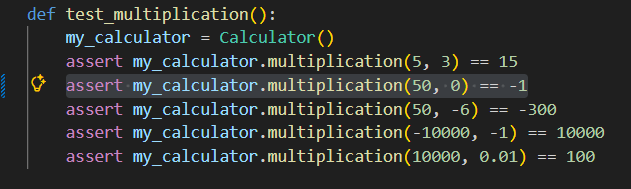
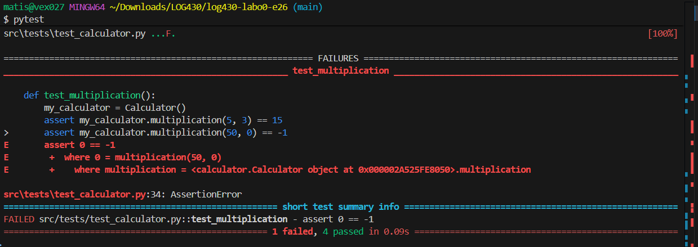
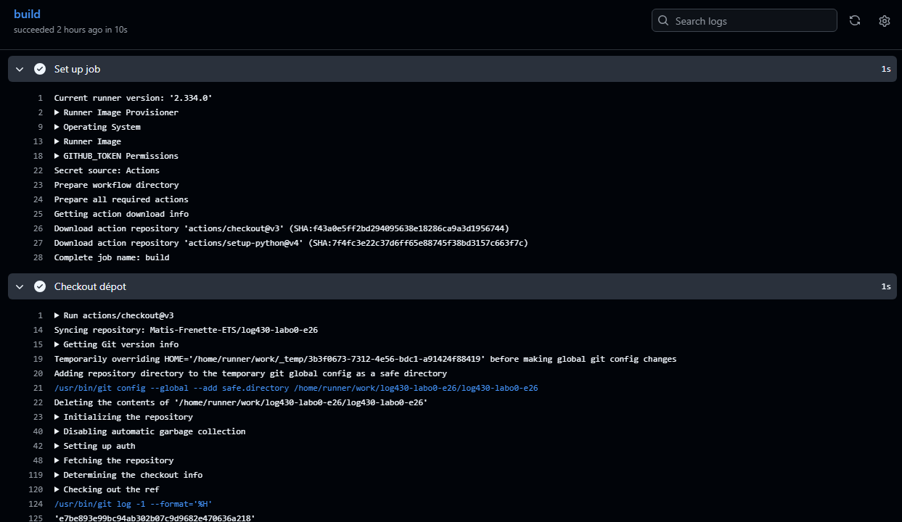
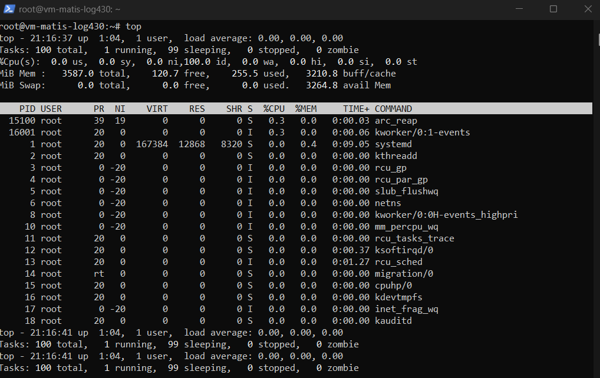

### Question 1: Si l'un des tests échoue à cause d'un bug, comment pytest signale-t-il l'erreur et aide-t-il à la localiser ? Rédigez un test qui provoque volontairement une erreur, puis montrez la sortie du terminal obtenue.

Lorsqu'un test echoue, pytest montre quel test est faux.

# Test mauvais:

# Resultat:

### Question 2: Que fait GitHub pendant les étapes de « setup » et « checkout » ? Veuillez inclure la sortie du terminal GitHub CI dans votre réponse.

Setup fait la mise en place pour que l'image soit en mesure de faire toutes les taches qui lui sont expecter.

Checkout fait la mise a jour du repot en effectuant un pull sur la version la plus recente.

### Question 3: Quel type d'informations pouvez-vous obtenir via la commande top ? Veuillez donner quelques exemples. Veuillez inclure la sortie du terminal dans votre réponse.

La commande top retourne des informations sur l'utilisation de la machine, comme la memoire utiliser et les programes qui sont entrain de fonctionner.

